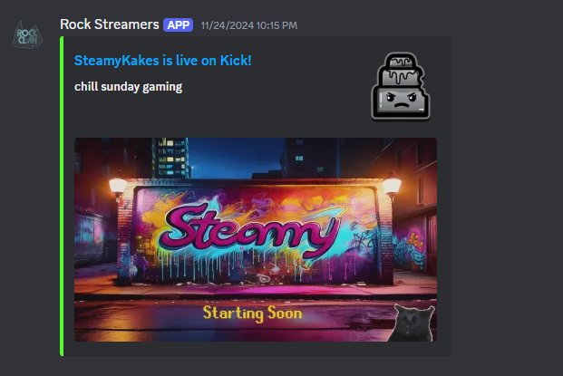
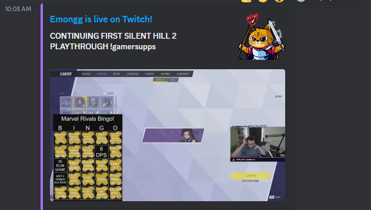

Get discord notifications when user-selected Kick and Twitch streams are live

--------------------------------------------------------------------------------

Rock Bot webscrapes Kick's API and utilizes Twitch API to determine live streamers.

Within 1 minute of your favorite streamer going live...
- Get discord channel notifications
- Real-time list of online and offline streamers

# Overview

Kick currently lacks an API readily available for users. Therefore, Kick websites are webscraped.
Twitch has a public API, so calls are made to receive streamer information.
All information is stored in PostgreSQL, which is inside a docker container.

# Demo

## FIXME: Insert flow chart here

## FIXME: Clean up code
