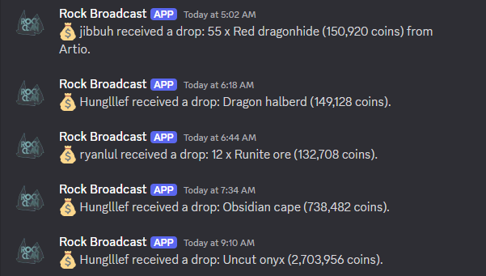

## Get discord notifications when user-selected Kick and Twitch streams are live

--------------------------------------------------------------------------------

Rock Bot webscrapes Kick's API and utilizes Twitch API to determine live streamers.

Features
- Get discord notifications within 1 minute of streamer going live
- Real-time list of online and offline streamers
- Store drops, player kills, and personal bests from OSRS game chat
- Filter game chat messages into specific channels using webhooks

# Overview

Kick currently lacks an API readily available for developers. Therefore, Kick websites are webscraped.
Twitch has a public API, so calls are made to receive streamer information.
All information is stored in PostgreSQL, which is inside a docker container.

# Demo

## FIXME: Insert flow chart here

## FIXME: Clean up code
